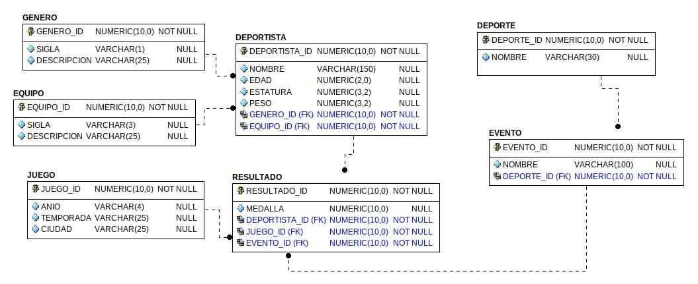

# OLYMPICS DATA MODELING -  AIRFLOW and DBT - POSTGRES

The idea behind this project is to model an star schema from raw normalized Olympic Games data

Using *dbt - postgres*, *airflow* and *docker*

___

## STEPS TO RUN

Before runing the command to **start containers** we need to create a **.env** file with the environment vars that the docker-compose.yaml file needs

It should look like this

Then we can run

    $ docker-compose up -d

Once the Airflow webserver UI is available on http://localhost:8080 we have to **add a new conn** from  before starting any DAG 

(has to match vars in the .env file)

Now we can start all DAGs and when they finish we can go to PG database container and check the tables were successfully created by DBT according to Airflow orchestration

    $ docker exec -i -t <container name> /bin/bash
    $ psql -U <pg user name>
    $ \dt

To the tables in the public schema

Also on http://localhost:3001 we can access Metabase and configure PG database and make some visualizations like this one

